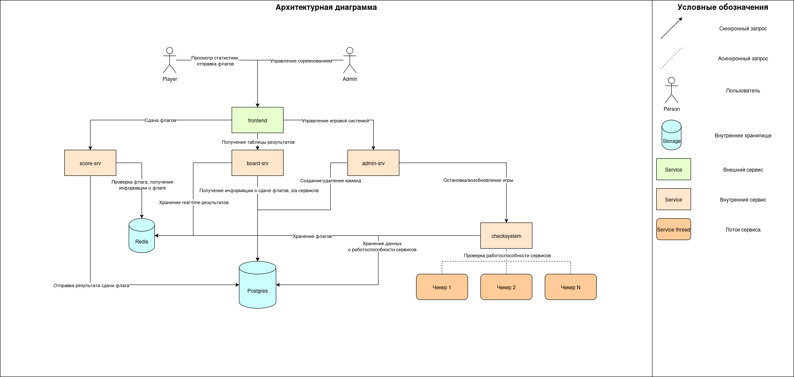

# ABOBA | CTF Attack-Defense Checksystem

Система для проведения соревнований CTF формата Attack-Defense

## Ахитектурная диаграмма

## Описание компонентов

**board-srv**
- Отдаёт скорборд
  - Очки по сервисам
  - Количество сданных/потерянных флагов по сервисам
  - SLA по сервисам
  - Сумму очков
  - Сложность у сервисов
  - Авторов сервисов
  - Текущее время раунда
- Отдаёт атак дату

**score-srv**
- Начисляет баллы по заданной формуле или формуле по умолчанию
- Принимает флаги от команд
- Валидирует запросы на сдачу флагов по командному токену
- Детектит First Blood'ы команд и фиксирует информацию об этом
- Фиксация логов о сдаче флагов (какая команда, флаг от какого сервиса, во сколько сдала)

**admin-srv**
- Добавление/удаление команды во время соревнования
- Пауза/возобновление соревнования
- Экспорт результатов соревнования
- Ручное начисление/списание баллов

**checksystem**
- Запуск чекеров на всех сервисах всех команд в отдельных потоках раз в N времени
- Запись информации об работоспособности сервисов
- Генерация флагов и отправка их в чекер
- Проверка флагов
