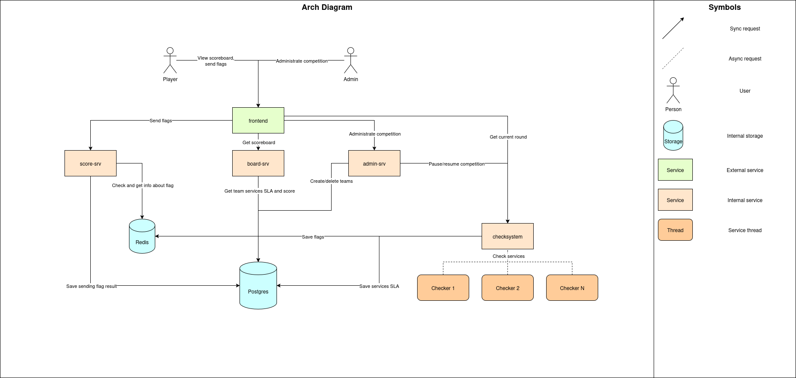

# ABOBA | CTF Attack-Defense Checksystem

System for CTF competitions in the Attack-Defense format

## Architecture diagram

## Component description

**board-srv**
- Returns the scoreboard
  - Points per service
  - Number of submitted/lost flags per service
  - Service SLAs
  - Total score
  - Service difficulties
  - Service authors
  - Current round time
- Returns attack-data

**score-srv**
- Calculates scores using either a custom formula or the default one
- Accepts flags from teams
- Validates flag submissions using team tokens
- Detects First Bloods and records them
- Logs flag submissions (which team, from which service, and at what time)

**admin-srv**
- Add/remove teams during the competition
- Pause/resume the competition
- Export competition results
- Manually adjust scores (add or remove points)

**checksystem**
- Runs checkers on all services of all teams in separate threads every N seconds
- Records service availability
- Generates flags and sends them to the checker
- Verifies flags previously set in services
